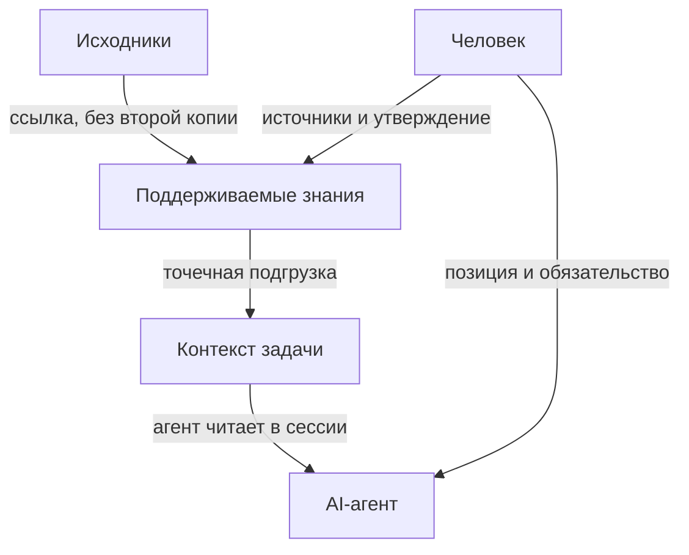

Файлы становятся базой знаний для агентов, когда есть понятные точки входа, три слоя, связи с источниками, проверка актуальности и обслуживание во время явной работы. Один владелец факта здесь только один из механизмов. Файлы сохраняют состояние между сессиями; в следующем запуске агент обновляет связи и собирает под задачу нужный контекст, а позиции, решения и обязательства утверждает человек.

## Папка рядом и база знаний

Папка с Markdown, хранилище Obsidian или набор проектных документов ещё не база знаний. Файлы просто лежат рядом. Копии появляются «для удобства». В промпт можно свалить почти всё. Память кажется историей чата.

В рабочей базе устройство другое. Вместо второй копии стоит указатель на владельца факта. Контекст приходит слоями: что всегда, что по запросу, что по адресу. Выводы сохраняются между сессиями в файлах со ссылками на источники и принятые решения.

Почему копия расходится с живым источником, разбирал как [один источник правды](/blog/ssot-documentation/). Один владелец факта здесь только один механизм. Рабочую базу также создают точки входа, три слоя, связи с источниками, проверка актуальности и обслуживание агентом.

## Три слоя

Я держу три слоя. Они отвечают на разные вопросы и меняются с разной скоростью. Близкая тема: [слои контекста по скорости изменения](/blog/context-architecture-lifecycle-split/).

**Исходники.** Материалы остаются у владельцев: переписки, транскрипты, код, базы, исследовательские заметки, публикации. Агент их читает и не собирает второй склад. Исходная версия остаётся в системе, где её обновляют.

**Поддерживаемые знания.** Здесь лежат короткие карточки тем, решения и проверенные ответы. Агент обновляет их во время работы, а человек подтверждает важные выводы. Полезный разбор сохраняется как страница и остаётся доступным после обсуждения.

**Контекст текущей задачи.** Под конкретный запуск собираются стартовые инструкции вроде `CLAUDE.md` и `AGENTS.md`, нужные правила и точечные обращения к страницам и источникам. [Документация Claude Code](https://code.claude.com/docs/en/memory) говорит: каждая сессия начинается без истории предыдущего диалога, а `CLAUDE.md` подхватывается в начале. [Codex](https://developers.openai.com/codex/guides/agents-md) до работы читает `AGENTS.md` и собирает цепочку от глобального уровня к текущей папке. По [Anthropic](https://www.anthropic.com/engineering/effective-context-engineering-for-ai-agents), контекст ограничен, поэтому в инструкциях лучше оставлять короткие указатели и открывать нужные файлы по задаче.

Разделяйте два вопроса: где хранится текущая версия факта и на каком источнике она основана. Если смешать их, становится непонятно, где править факт и чем его проверять.

## Кто что делает

Агент обновляет страницы и связи. Человек утверждает решения и обязательства.

Человек курирует источники, задаёт направление и границы тем. Агент связывает, оформляет, предлагает ответ, собирает контекст и показывает правку. Правки с низкой ценой ошибки агент может вносить самостоятельно. Позиция и обязательство проходят через человека.

`CLAUDE.md` и `AGENTS.md` это стартовые инструкции для сессии. Сама база шире: исходники, опорные страницы, решения, ответы и карта, куда за чем идти.

## Как база знаний обновляется

Новый материал проходит три шага.

1. Появляется материал со связью к источнику. На опорной странице появляется ссылка на исходник, без его полной копии.
2. Устойчивый вывод закрепляется: карточка темы, запись в журнале решений или новая версия ответа.
3. Полезный вывод сохраняется на странице и доступен агенту в следующей сессии.

Отдельно работает обслуживание. Периодический аудит находит страницы без ссылок, повторяющиеся сведения, недатированные статусы и неработающие указатели. Claude Code читает `CLAUDE.md` в начале каждой сессии, а Codex собирает цепочку `AGENTS.md` при каждом запуске. Файлы инструкций загружаются отдельно от заметок.

## Как это выглядит у меня

Вот четыре примера из моей системы.

**Указатель вместо копии.** По моему правилу цены, статусы, воронка и метрики не должны жить второй копией в Markdown. Рабочий документ указывает на код, базу или [один файл, который кормит многих агентов](/blog/data-layer-for-agents/). Так данные, которые часто меняются, остаются у системы-владельца, а документ не устаревает вместе с ними.

**Центральная карта.** Одна и та же короткая карта живёт и в Git, и в Obsidian: один набор файлов, две поверхности. Она показывает, что где лежит и кто владеет темой. Сами материалы и исполнение остаются у владельцев. Агенту нужна такая карта, чтобы не искать тему по всему дереву файлов.

**Правила для агента.** Файл правил проекта лежит в `CLAUDE.md`, а `AGENTS.md` указывает на те же правила. Claude Code и Codex получают один набор. Подробнее: [AGENTS.md как единый файл правил](/blog/agents-md-source-of-truth/).

**Опорная страница темы.** Карточка темы держит вопросы, версии ответов, их состояния и ссылки на исходники. Агент обновляет только доверенную ему часть карточки и не трогает текст автора. Исходники остаются у владельцев. Поддерживаемое знание остаётся тонкой связанной страницей, без второго архива чатов.

Похожую схему описал Andrej Karpathy в файле идей [LLM Wiki](https://gist.github.com/karpathy/442a6bf555914893e9891c11519de94f): неизменяемые источники, база страниц в Markdown и файл инструкций вроде `CLAUDE.md` или `AGENTS.md`. Такая база сохраняет прошлые выводы, чтобы не собирать их заново при каждом вопросе. Это файл идей, без претензии на продукт и без названия моей системы.

Здесь разбираю только устройство файловой базы знаний. Когда усиливать сбор контекста другими способами, разберём отдельно. Сейчас полезнее проверить уже существующие файлы.

## Промпт аудита уже существующих файлов

Скопируй агенту в корне папки с знаниями.

Промпт для Claude Code или Codex:


Посмотри мои файлы как базу знаний для AI-агентов.

Ничего не перестраивай, не перекладывай и не переписывай. Только изучи то, что уже есть, и объясни.

Мне важно понять:
- как у меня устроены слои: где исходники, где поддерживаемые знания, где правила и точки входа для агента;
- где один и тот же смысл, похоже, написан дважды и может разойтись;
- где лежат утверждения про «как сейчас», цены, статусы или метрики без даты и без явной связи с живым источником;
- есть ли понятная точка входа для агента вроде CLAUDE.md или AGENTS.md, и не размножены ли правила копиями;
- где видны опорные страницы, решения и ответы, а где просто склад заметок;
- какие ссылки и указатели ведут в никуда или не отвечают, кто владеет темой.

Опирайся только на файлы, которые реально видишь. Если чего-то не видно, так и скажи.

В ответе мне нужно:
1. Короткий вердикт простым языком.
2. Картина слоёв: что нашёл и чего не хватает.
3. Главные риски: где увидел, что насторожило и что мне проверить.
4. Что уже сделано хорошо.
5. Чего сейчас не делать.
6. Несколько вопросов ко мне, без которых рано предлагать новую структуру.

Не предлагай перестройку файлов. Сначала опиши их текущее состояние.


## Частые вопросы

### Чем это отличается от «просто хороших заметок»?

В базе для агента есть ссылки на источники, актуальные страницы и инструкции для текущей задачи. Агент обновляет связи во время работы, а человек подтверждает решения.

Модель можно сменить. База остаётся полезной, если есть ясные точки входа, три слоя и обслуживаемые связи с источниками.

Похожие штуки собираю в Personal Corp. [Подробнее](https://t.me/hashslash_bot?start=pc_blog_agent_kb).
