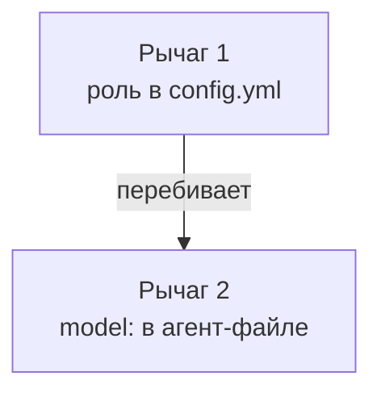
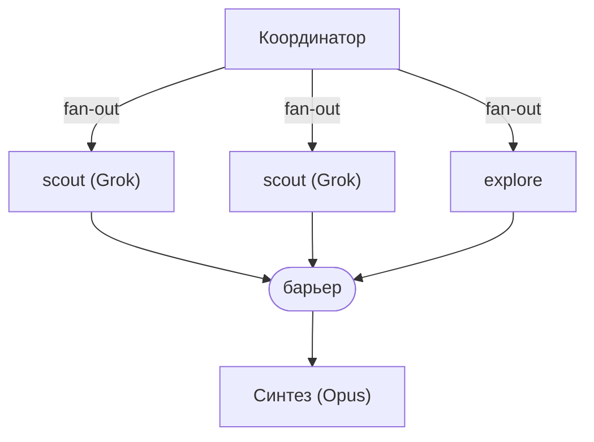

[**omp**](https://omp.sh) (Oh My Pi) — это терминальный кодинг-харнесс: агент живёт прямо в терминале, читает и правит файлы, гоняет команды. И оркестрация в нём устроена так, что кнопки «запустить команду» попросту нет. Она сводится к трём вещам: ты остаёшься координатором, сажаешь под каждую роль свою модель и запускаешь работу как карту зависимостей. Grok на разведку, Opus на синтез. Два `scout`'а ищут в разных файлах параллельно, синтез ждёт обоих на барьере. Примитивы живут внутри той же терминальной сессии, где ты уже сидишь. Без отдельного рантайма.

[В последних лайвах](https://youtu.be/Nh6Qui9VSUk) всё крутилось вокруг одного вопроса: как собрать команду агентов и правильно её запустить. Claude Code на Opus плюс Codex остаётся основным стеком, а про то, как тот же вопрос решается в omp, и есть этот пост. Сам omp активно обсуждали в [чате вайбкодеров](https://t.me/vibecod3rs/84959).

## Проблема: разведка на дорогой модели и «где кнопка»

Первая боль: деньги и скорость. Когда агент лезет читать файлы, грепать репозиторий, искать один факт в куче документов, это разведка. По умолчанию она едет на той же тяжёлой модели, что и всё остальное. Opus, который читает `products.md` ради одной строчки, это из пушки по воробьям. Справится. Но зачем.

Вторая: я не понимал, как «запустить команду». В голове была картинка: собрал агентов, нажал старт, они разошлись. Такой кнопки в omp нет, и это сбивало, пока не дошло: координатор здесь ты сам.

## Решение: модель под роль

Я залогинился почти во всех провайдерах. Рядом с Anthropic (Claude Code, Opus) и OpenAI (Codex) появился доступ к Grok, ради него в основном и логинился. И попросил агента навести порядок с моделями.


настрой себя, чтобы использовать разные модели (не клод) для разведки на быстрых моделях, я залогинился почти везде


Роутинг модели в omp держится на двух рычагах, и путать их не стоит.



Агент завёл нового бойца, `scout`: read-only инструменты, во frontmatter прописан `model: grok-4.20-non-reasoning`. Я сразу спросил, зачем плодить сущности.


почему ты сделал нового агента, а не использовал готовый explore?


Ответ кроется в устройстве omp. У встроенного `explore` нет своего role-слота: он молча наследует `default`, а `default` у меня Opus. Посадить разведку на Grok через роль просто нечем, слота нет. Единственный способ пиннуть модель конкретному разведчику — `model:` в его агент-файле. Так и появился отдельный `scout`. Канонично ли это, я уточнил.


а как правильно по правилам omp?


Приоритет в omp такой: `model` агента перебивает роль и дефолт. Роли (`modelRoles`) задают грубый рычаг на весь класс задач. Читаются на старте сессии и на лету не подхватываются: правку роли я проверял, сабагентов она не переехала. А точечный пин через агент-файл — first-class способ сказать «вот этому разведчику вот эту модель». Тот же принцип я раньше разбирал для субагентов Claude Code: [извлечение на дешёвой модели, анализ и создание на дорогой](/blog/subagent-model-cost/).

Живьём вышло приятно. `scout` реально ушёл на Grok 4.20 non-reasoning: без оверхеда на рассуждения, с огромным окном контекста. Нашёл нужную строку за ~7 секунд и стоил $0, потому что едет по OAuth-подписке, а не по API-биллингу. Ровно та [двухступенчатая логика](/blog/two-stage-ai-pipeline/), к которой я пришёл раньше: быстрая модель извлекает, качественная генерирует.

И это не самодеятельность. Anthropic в разборе своей мультиагентной Research-системы описывает то же самое: Opus 4 ведущим, Sonnet 4 сабагентами. Такая связка обошла одиночный Opus 4 на 90.2% на их внутреннем эвале. Сильная модель координирует и синтезирует, модели побыстрее делают параллельную беготню. Оговорка оттуда же: мультиагент жжёт примерно в 15 раз больше токенов, чем обычный чат. Потому и хочется отдать всю разведку дешёвой модели.

## Решение: оркестрация как карта зависимостей

Дальше запуск. Я собрал команду из агент-файлов и спросил прямо.


как правильно делать оркестрацию в omp? я собрал команду — как запустить, чтобы всё пошло?


Выяснилось: координатором работает главный агент, то есть по факту я через него. «Команда» — это агент-файлы, «запуск» сводится к раздаче рабочих элементов. Способов три.

`task` даёт фан-аут: батч задач уходит одной параллельной волной, потолок около 32 разом. Независимые куски разлетаются сразу, в async-режиме тут же возвращается `job id`, а результат приходит сам. Это [параллельные субагенты без потери контекста](/blog/mapreduce-subagents/), каждый в своём окне.

`eval` строит DAG, направленный граф зависимостей. `parallel` пускает одну волну, `pipeline` разбивает её на волны с барьером между стадиями. Ребро графа появляется, когда результат одного агента (`handle` или `output`) уходит в промпт следующему. Вниз по цепочке едет ссылка, а не весь транскрипт. Тем же приёмом, что Anthropic зовёт защитой от «испорченного телефона»: сабагент кладёт вывод в файл, а дальше передаётся указатель.

`irc` включает живую координацию: агенты переписываются между собой, припаркованный оживает от сообщения.



Проверил на маленьком примере: двухступенчатый `scout`-пайплайн, сначала найти файл-владелец, потом вычитать из него факты. Обе стадии проехали на Grok, без ручного вмешательства между ними: ребро графа само прокинуло путь к файлу во вторую стадию.

Такое деление придумал не omp. OpenAI в своём Agents SDK прямо разводит два режима: «оркестрация через LLM», где модель сама решает, кому передать управление, и «оркестрация через код», детерминированная по скорости и стоимости, вплоть до запуска независимых задач через `asyncio.gather`. Один в один omp: `task`-фан-аут отвечает «пусть координатор решает», `eval`-DAG говорит «я развёл зависимости руками». У LangGraph та же идея графа с параллельными ветками и барьером. А именованные агент-определения со своим набором инструментов работают как agent teams в Claude Code, ближайший сосед `.omp/agents`.

Разница в весе. LangGraph, CrewAI, отдельные оркестраторы вроде [демона, который сам раздаёт задачи Codex](/blog/symphony-codex-orchestrator/) приносят отдельный рантайм, который принимаешь в проект. omp даёт тот же фан-аут, DAG и переговоры примитивами прямо в терминале, а тяжёлое, изолированное и кросс-репо уводит в соседнее приложение, Orca. Отсюда и нет кнопки: ты не жмёшь старт, ты рисуешь карту зависимостей. Anthropic отмечает, что в кодинге по-настоящему параллельных задач меньше, чем в ресёрче, так что держать человека координатором, по-моему, надёжнее, чем запускать автономный рой.

## Результат и мета-факт

Разведка на Grok заняла ~7 секунд и $0. DAG отработал вживую. Модель перестала быть константой и стала настройкой роли.

И мелочь напоследок: эту статью я собрал тем же приёмом, как эксперимент. Попросил агента исследовать тему, research-сабагент на Opus сходил через web_search к первоисточникам (тот самый разбор Anthropic, доки OpenAI), `scout` на Grok отранжировал находки, из этого получился бриф, а из брифа черновик. Фан-аут, барьер, синтез.

## Мелочи, на которых спотыкаешься

«Команда» звучит как метафора, а по факту это папка `~/.omp/agent/agents/`. Каждый файл внутри задаёт участника: со своим `model:` во frontmatter и своим набором инструментов. `scout` сидит на быстром Grok с read-only инструментами, позже я завёл таким же способом отдельного агента под генерацию картинок. Приём обобщается за пределы разведки: любой повторяющийся кусок работы можно вынести в файл и пиннуть ему свою модель.

Главная грабля во всём этом: настройки читаются на старте сессии. Сессия подхватывает роли (`modelRoles`) и провайдер один раз, на старте, и на лету их не видит. Поменял конфиг и не перезапустился, текущая сессия едет на старом значении. Я на это напоролся вживую: правка роли до уже запущенных сабагентов не доехала.

Поэтому другую конфигурацию я проверяю отдельным процессом, живую сессию не трогая:

```
omp -p "..." --config <overlay.yml>
```

Свежий старт даёт свежие настройки. Overlay прилетает только в этот запуск, основная сессия остаётся как была.

## Выводы

Модель — не константа, а настройка роли. Быстрым моделям разведку, умным синтез. Один Opus на все задачи всё равно что один нож на всю кухню.

Оркестрация — это карта зависимостей. Независимое уходит в параллель через `task` (до ~32 разом), зависимое ложится в DAG через `eval` с барьером, переговоры идут через `irc`.

omp делает терминал-нативно то, что LangGraph и CrewAI решают тяжёлым рантаймом. Ты остаёшься координатором и получаешь фан-аут, DAG и живую координацию, не притаскивая в проект новую платформу.

Похожие штуки, команду агентов и отделы на них, собираю в Personal Corp: [подробнее](https://t.me/hashslash_bot?start=pc_blog).
