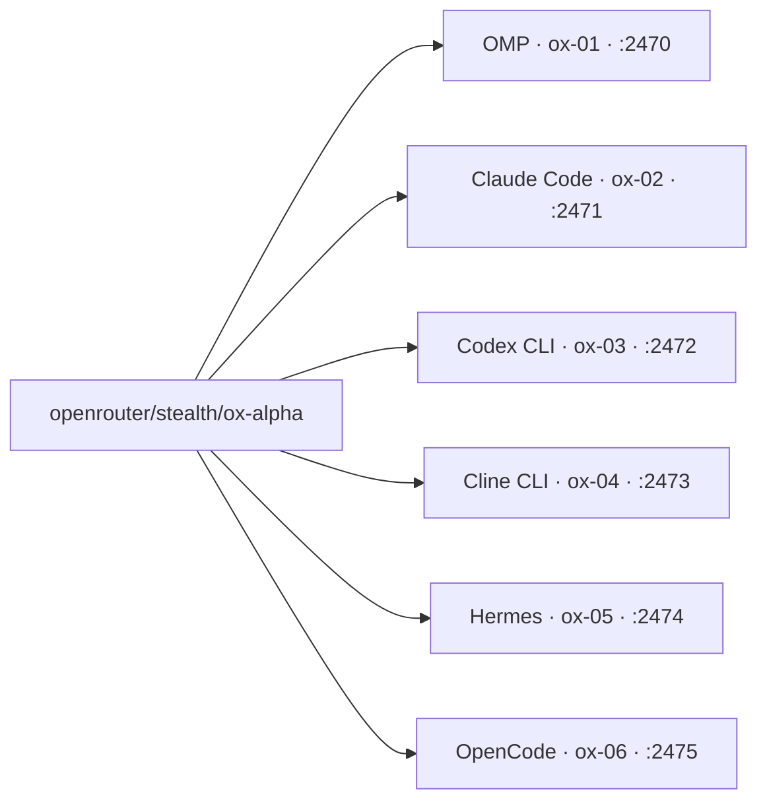

<style>
.pre.mermaid svg, pre.mermaid svg { max-width: 100% !important; height: auto !important; }
pre.mermaid { overflow-x: auto; }
</style>

21 августа Nous Research показала Ox Alpha. Вечером того же дня у меня стояло шесть чистых контейнеров, один ключ OpenRouter и один промпт на всех. К ночи четыре агента отдали работающую страницу, двое не уложились. Вечер при этом съели два инфраструктурных косяка: IP-план и порядок sshd-конфов.

## Паспорт подопытной

Паспорт у неё короткий. Ox Alpha анонсирована 21 августа 2026 и какое-то время раздаётся бесплатно через портал Nous Research. Контекст 1 048 576 токенов. Максимальный вывод 131 072. На OpenRouter она лежит слагом `stealth/ox-alpha`, ходить к ней можно обычным OpenAI-совместимым запросом с одним ключом, отдельной инфраструктуры под каждого агента не нужно. На вопрос "кто тебя сделал" отвечает "undisclosed organization", и это остаток паспорта.

Цифра 131 072 ещё вернётся.

## Зачем вообще пул

В чате модель отвечает красиво и согласованно. Мне нужно было другое: одна и та же модель внутри разных агентов, у каждого свой характер, свой системный промпт и свой набор инструментов. Харнесс определяет половину впечатления, поэтому судить модель по одному агенту бессмысленно.

Второй мотив: чистые стенды. На моей рабочей машине годы локального мусора, конфиги и кэши со старыми ключами. Контейнер с нуля закрывает вопрос "модель или моя среда".

Когда выходила [Grok 4.6](/blog/grok-46-day-one/), я писал, что гнаться за каждым релизом незачем. Посмотреть новинку в деле по-прежнему интересно, и вот такой смотр.

## Сборка

Код руками я не пишу, поэтому пул собирали агенты по спецификациям. На хосте с Proxmox лежал готовый шаблон контейнера на Debian 13. Агент склонировал его шесть раз: все клоны unprivileged, сеть на отдельном внутреннем мосту, в каждом свой харнесс. На 21 августа пул состоял из шести стендов.



Ключ OpenRouter лёг файлом `/root/.openrouter_key` с правами 600. Дальше раскладка разъехалась по агентам. Четверым хватает загрузчика в `/etc/profile.d`. Hermes требует экспорта вручную прямо перед запуском. Cline держит ключ у себя в `providers.json` и получает его отдельной командой авторизации. Один ключ, три разных способа его отдать.

## Две ловушки, которые съели вечер

Смоук-тест нонсом прошёл с первого раза на всех шести. Доступ снаружи не прошёл вообще.

Ловушка первая: клонирование раздало контейнерам адреса 10.70.0.70–.73, уже занятые пулом ботов, поднятым неделей раньше. ARP на мосту захватил чужие MAC-адреса, проброс портов увёл меня в соседний пул. SSH на 2470 отвечал незнакомым host-key и `Permission denied`. Лечится перенумерацией на .90–.93 и правкой базы адресов в NAT-скрипте.

Ловушка вторая тоньше. Дропин sshd с `PermitRootLogin` агент положил под именем `99-oxalpha.conf`, а в шаблоне уже лежал `60-pc2-student.conf` с запретом. В sshd побеждает первое прочитанное значение, так что `99-` проигрывал молча. Переименовали в `50-oxalpha.conf`: root-логин заработал, `journalctl` перестал сыпать `ROOT LOGIN REFUSED`, скан host-key совпал с контейнерами.

Наружу пул смотрит портами 2470–2475. Правила поднимает systemd-юнит `oxalpha-nat.service`, который запускает скрипт `oxalpha-nat.sh` с таблицей порт → контейнер.

## Что потребовал каждый харнесс

| Стенд | Харнесс | Что понадобилось сверх дефолта |
|---|---|---|
| ox-01 | OMP 17.4.2 | ставится через bun, провайдер в `~/.omp/agent/models.yml`, роли default и task на `openrouter/stealth/ox-alpha` |
| ox-02 | Claude Code 2.1.239 | `ANTHROPIC_BASE_URL=https://openrouter.ai/api`, `ANTHROPIC_AUTH_TOKEN` равен ключу, `ANTHROPIC_API_KEY` пустой (иначе перекрывает токен) |
| ox-03 | Codex CLI 0.149.0 | `wire_api="responses"`, chat wire API удалён апстримом ([детали у OpenAI](https://github.com/openai/codex/issues/7782)) |
| ox-04 | Cline CLI 3.0.56 | headless-запуск `cline --json --timeout N`, ключ через `cline auth openai-compatible`, результат в поле `run_result` |
| ox-05 | Hermes agent v0.20.5 | one-shot флаг `-z` |
| ox-06 | OpenCode 1.18.21 | провайдер `openrouter`, `apiKey = {env:OPENROUTER_API_KEY}`, запуск через login-shell |

Отдельно про Codex. Параметр `model_reasoning_effort` там обязателен: без него эндпоинт отклоняет запрос. Значения выше `low` эндпоинт принимает спокойно, только модель на них уходит в лишние рассуждения и до инструментов добирается заметно позже.



## Первый настоящий тест

Стенды есть, нужен общий прогон. В чате проскочил промпт Александра Соболя про 3D-сцену выстрела на Three.js, и я взял его сидом бенча. Дословный текст ушёл во все шесть харнессов, к каждому я добавил одинаковый операционный суффикс: "Сохрани итог как index.html в текущей папке".


```
Создай самодостаточную интерактивную веб-страницу с кинематографичной 3D-сценой на Three.js. Покажи в разрезе стилизованный пистолет и полный цикл выстрела: воспламенение, расширение газов, движение затвора, вылет пули, гильзы и дыма. Камера должна следовать за пулей в замедленном времени, показывая вращение, сопротивление воздуха, гравитацию и удар в стальную стену с деформацией, искрами и волной напряжения. Добавь управление камерой, паузу, повтор, скорость времени и подписи физических процессов. Используй правдоподобную, но учебно-иллюстративную физику без реальных оружейных чертежей и точных конструктивных размеров. Результат — один запускаемый HTML-файл без сборки.
```


Артефакты агент скопировал обратно на Mac и сверил sha256: между контейнером и маком байт в байт. В таблицу я пустил только размер и время. Визуальная оценка осталась за её пределами, потому что байты и минуты не врут.

| Харнесс | CT | Время (wall-clock) | Размер index.html | Статус |
|---|---|---|---|---|
| Codex CLI 0.149.0 | ox-03 | ~5.5 мин | 14 610 B | успех |
| Hermes agent v0.20.5 | ox-05 | ~9.4 мин | 19 191 B | успех |
| Claude Code 2.1.239 | ox-02 | ~57 мин | 76 823 B | успех |
| OMP 17.4.2 | ox-01 | ~80 мин | 652 681 B (Three.js инлайнен внутрь файла) | успех |
| Cline CLI 3.0.56 | ox-04 | таймауты 900 s и 1500 s при живой работе | не собран | не уложился |
| OpenCode 1.18.21 | ox-06 | два прогона `finish=length`, лимит вывода съеден рассуждениями | не собран | исход не зафиксирован |

Четыре страницы открылись и заработали.






Статика тут врёт: вся разница живёт в движении. Тот же цикл выстрела у всех четырёх, по возрастанию размера артефакта.

**Codex CLI**

<video controls loop muted src="/images/blog/ox-alpha-harness-pool/codex-cycle.webm"></video>

**Hermes agent**

<video controls loop muted src="/images/blog/ox-alpha-harness-pool/hermes-cycle.webm"></video>

**Claude Code**

<video controls loop muted src="/images/blog/ox-alpha-harness-pool/claude-code-cycle.webm"></video>

**OMP**

<video controls loop muted src="/images/blog/ox-alpha-harness-pool/omp-cycle.webm"></video>

Если видео не играет, есть GIF-версии: [Codex](/images/blog/ox-alpha-harness-pool/codex-cycle.gif), [Hermes](/images/blog/ox-alpha-harness-pool/hermes-cycle.gif), [Claude Code](/images/blog/ox-alpha-harness-pool/claude-code-cycle.gif), [OMP](/images/blog/ox-alpha-harness-pool/omp-cycle.gif).

## Кто кого задушил

Вот теперь про 131 072.

OpenCode дважды остановился на `finish=length`, не вызвав ни одного инструмента: весь доступный вывод в 32k ушёл в рассуждения. Читается это как потолок модели, пока не заглянешь в паспорт. Эти 32k пришли от харнесса. Клетка оказалась вчетверо меньше зверя.

Я поднял лимит до 64k и запустил заново. Чем кончился тот прогон, я не зафиксировал. Это единственный незакрытый пункт эксперимента.

Cline упёрся в другое. Агент работал живьём, и всё равно не уложился ни в 900 секунд, ни в 1500. Для сравнения, смоук-команда по умолчанию ждёт 300.

Отсюда главное наблюдение вечера. Половину результата пишет обвязка вокруг модели: лимит вывода, таймаут, набор инструментов, дефолтный уровень рассуждений. Два стенда из шести провалились по параметрам харнесса, при живой и рабочей модели внутри.

## Как повторить

Пул вырос из серии задач агенту: бутстрап инфраструктуры, раскладка ключей, отдельная спецификация на установку каждого харнесса, потом фиксы по инцидентам. Одним промптом такое не собрать. Минимальный честный путь выглядит так.

1. Склонировать шаблонный контейнер шесть раз. Адреса брать заведомо свободные: сверить план со всеми конфигами контейнеров на хосте и с активными правилами проброса портов. Первые грабли живут ровно тут.
2. В каждом клоне положить sshd-дропин с `PermitRootLogin` под префиксом `50-`, чтобы он читался раньше запрещающих дропинов из шаблона. Вторые грабли.
3. Ключ провайдера в `/root/.openrouter_key` с правами 600 и загрузчик через `/etc/profile.d`. Для Hermes дописать ручной экспорт в шпаргалку запуска, для Cline завести ключ его собственной командой авторизации.
4. Проброс наружу: systemd-юнит, который поднимает NAT-правила по таблице порт → контейнер, по одному порту на стенд.
5. Установку каждого харнесса отдать агенту отдельной спецификацией: версия, конфиг провайдера, способ передачи ключа, команда one-shot.
6. Смоук нонсом на каждом стенде: попросить агента вернуть уникальную строку. Шесть ответов ОК означают, что пул готов к бенчу.

Вся подготовка заняла один вечер.

## Вывод

Модель проверяют делом, и лучше сразу в шести руках. Пул одинаковых стендов превращает "мне кажется" в числа: размер артефакта, минуты, совпадение хэшей. Модель одна на всех, а поведение агентов разъехалось почти в пятнадцать раз по времени и в сорок пять раз по весу файла.

Пулу нужна общая задача, иначе он превращается в вентилятор: сто агентов, ноль результата, как я уже [писал](/blog/orchestration-without-goals/). С одним промптом он выдаёт ответ за вечер.

## Частые вопросы

### Зачем сразу шесть харнессов, хватит ли одного?

Один агент всегда похвалит модель, шесть начинают спорить между собой. Плюс чистые контейнеры снимают вопрос "а может, это мой локальный мусор". Цена вопроса один вечер.

### Это только для выхода новой модели?

Пул одинаково полезен для пары "старая против новой" и для проверки обновления харнесса: склонировал свежий стенд из шаблона и сравнил со старым числом.

### Почему размеры артефактов различаются в сорок пять раз?

Самый тяжёлый файл, 652 681 B от OMP, втянул Three.js внутрь себя. Размер тут показывает привычки агента по упаковке результата. Качество сцены он не меряет.

### Почему два харнесса не собрали артефакт?

Оба упёрлись в свои настройки: OpenCode в лимит вывода, Cline в таймаут. Модель в обоих случаях работала. Это ровно та причина, по которой стоит держать шесть стендов вместо одного.


Хочешь так же? В [Кружке](https://t.me/hashslash_bot?start=blog_oxalpha_pool) разбираем это на практике, с агентами и вживую.
