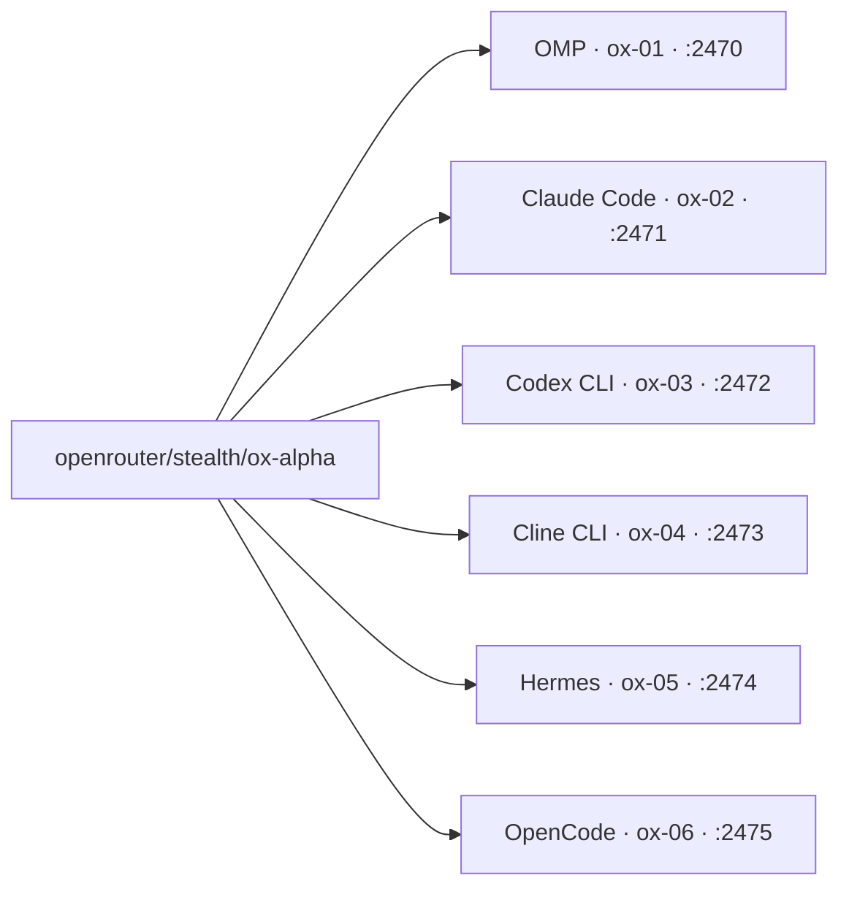

Новая модель вышла, и проверять её в чате скучно: интереснее смотреть, что она умеет в руках разных агентов. Я поднял пул из шести изолированных стендов с одной и той же моделью за один вечер. Вердикт: поднимать пул стоит, если хочешь честно сравнить модель в разных харнессах. Один шаблон LXC и один ключ OpenRouter закрывают всю подготовку. Ломается при этом не модель. Ломаются IP-план и порядок sshd-конфов, и именно там я потерял вечерние часы.

Пара слов о подопытной. ox-alpha: stealth-модель на OpenRouter со слагом stealth/ox-alpha, доступ через обычный OpenAI-compatible API и один ключ, без отдельной инфраструктуры под каждого агента. На вопрос «кто тебя сделал» отвечает «undisclosed organization», и это весь паспорт. Что видно за день работы: рассуждает она очень долго до первого действия. В OpenCode два прогона выжгли весь лимит вывода в 32k токенов на reasoning, не вызвав ни одного инструмента. Самые долгие успешные генерации: Claude Code ~57 минут, OMP ~80 минут.



## Зачем пул

В чате модель отвечает красиво и согласованно. Проверка другая: одна и та же модель внутри шести разных агентов, каждый со своим характером и набором инструментов. Харнес определяет половину впечатления. Судить модель по одному агенту бессмысленно.

Второй аргумент: чистые стенды. В моих рабочих машинах годы локального мусора: конфиги, кэши, старые ключи. Контейнер с нуля отвечает на вопрос «модель или моя среда».

Когда выходила [Grok 4.6](/blog/grok-46-day-one/), я писал, что гнаться незачем, но посмотреть новинку в деле интересно. Такой смотр и получился.

## Из чего собрано

Код руками я не пишу, поэтому собирал пул через агентов. На хосте citadel-pve01 с Proxmox VE 9.2.9 лежал готовый шаблон контейнера CT400 на Debian 13. Попросил агента склонировать его шесть раз: получились CT463-468 с именами ox-01…ox-06, все unprivileged, сеть на отдельном мосту vmbr1. Ключ OpenRouter лёг в каждый клон файлом `/root/.openrouter_key` с правами 0600 и экспортом через `/etc/profile.d/oxalpha.sh`.

Дальше агент поставил по харнессу в каждый клон и прогнал смоук-тест нонсом. Все шесть ответили ОК: OMP_NONCE_OK, CC_NONCE_OK, CODEX_NONCE_OK, CLINE_NONCE_OK, HERMES_NONCE_OK, OC_NONCE_OK.

Что стоит знать про каждого:

- **OMP** (@oh-my-pi/pi-coding-agent) 17.4.2. Провайдер прописан в `~/.omp/agent/models.yml`, роли default и task указывают на openrouter/stealth/ox-alpha.
- **Claude Code** 2.1.239 работает через «антропиковский» эндпоинт OpenRouter: ANTHROPIC_BASE_URL=https://openrouter.ai/api, ANTHROPIC_AUTH_TOKEN равен ключу OpenRouter, ANTHROPIC_API_KEY пустой.
- **Codex CLI** 0.149.0 потребовал wire_api="responses": chat wire API удалён апстримом, [детали у OpenAI](https://github.com/openai/codex/issues/7782). Ещё model_reasoning_effort="low" обязателен, другие значения эндпоинт отклоняет.
- **Cline CLI** 3.0.56 ходит headless: `cline --json --timeout N "промпт"`, авторизация через `cline auth openai-compatible`.
- **Hermes agent** v0.20.5 запускается one-shot флагом `-z`, инструменты согласились работать с --yolo.
- **OpenCode** 1.18.21 взял провайдера openrouter с apiKey = {env:OPENROUTER_API_KEY}.

Снаружи доступ идёт через DNAT портов 2470-2475 на контейнеры, systemd unit oxalpha-nat.service поднимает правила. На Mac заведены алиасы ox01…ox06, любой стенд открывается в одну команду.

## Два грабли дня

Два инцидента съели больше времени, чем вся установка.

Первый: новые клоны получили те же адреса .70-.73, что у уже работавшего пула. ARP на мосту стал указывать на чужие MAC-адреса. DNAT порт 2470 отвечал не той машиной, и ssh выдавал «Permission denied» без понятной причины: я стучался в чужой host key. Агент перенумеровал весь пул в .90+. Урок: теперь перед клонированием агент сверяет планируемые IP со всеми файлами в `/etc/pve/lxc/`.

Второй тоньше. Root-SSH не работал, хотя конфиг задавал PermitRootLogin prohibit-password. Оказалось, другой drop-in, 60-pc2-student.conf, ставит PermitRootLogin no и сортируется раньше моего 99-oxalpha.conf. В sshd_config побеждает первое полученное значение. Агент переименовал файл в 50-oxalpha.conf, всё ожило.

Про конфиги на нескольких машинах я уже писал в [заметке про синхронизацию Claude Code на четырёх компах](/blog/sync-claude-code-four-machines/), но контейнеры к порядку сортировки требовательнее любого мака.

## Первый настоящий тест

Стенды есть, нужен настоящий тест. В чате проскочил промпт Александра Соболя про 3D-сцену выстрела на Three.js, и я взял его сидом бенча. Прогнал дословный промпт во все шесть харнессов, к каждому добавил одинаковый операционный суффикс «Сохрани итог как index.html в текущей папке».


```
Создай самодостаточную интерактивную веб-страницу с кинематографичной 3D-сценой на Three.js. Покажи в разрезе стилизованный пистолет и полный цикл выстрела: воспламенение, расширение газов, движение затвора, вылет пули, гильзы и дыма. Камера должна следовать за пулей в замедленном времени, показывая вращение, сопротивление воздуха, гравитацию и удар в стальную стену с деформацией, искрами и волной напряжения. Добавь управление камерой, паузу, повтор, скорость времени и подписи физических процессов. Используй правдоподобную, но учебно-иллюстративную физику без реальных оружейных чертежей и точных конструктивных размеров. Результат — один запускаемый HTML-файл без сборки.
```


Каждый артефакт скопировали обратно на Mac и сверили sha256: byte-identical между контейнером и маком. Замеряются только размер файла и время. Визуальную оценку оставил за пределами таблицы: байты и минуты не врут.

| Харнесс | CT | Время (wall-clock) | Размер index.html | Статус |
|---|---|---|---|---|
| Codex CLI 0.149.0 | ox-03 | ~5.5 мин | 14 610 B | успех |
| Hermes agent v0.20.5 | ox-05 | ~9.4 мин | 19 191 B | успех |
| Claude Code 2.1.239 | ox-02 | ~57 мин | 76 823 B | успех |
| OMP 17.4.2 | ox-01 | ~80 мин | 652 681 B (Three.js инлайнен внутрь файла) | успех |
| Cline CLI 3.0.56 | ox-04 | таймауты 900 s и 1500 s при живой работе, 131k input-токенов | не собран | не уложился |
| OpenCode 1.18.21 | ox-06 | два прогона finish=length: cap в 32k съеден reasoning-токенами | не собран | корректирующий запуск с лимитом 64k был ещё в работе на момент правки |


## Как повторить

Сразу честно: одним промптом это не собиралось. Пул вырос из серии задач агенту: бутстрап инфраструктуры, раскладка ключей, отдельная спецификация на установку каждого харнесса, потом фиксы по инцидентам. Если захотите повторить, минимальный честный путь такой.

1. Склонировать шаблонный CT шесть раз, IP взять чистые, сверив план со всеми `/etc/pve/lxc/*.conf`. Грабли №1 как раз тут: коллизия .70-.73.
2. Внутри каждого клона ssh-бутстрап: host keys, `RuntimeDirectory=sshd`, drop-in с `PermitRootLogin` ИМЕННО с префиксом `50-`, чтобы пересилить `60-*-student.conf`. В sshd побеждает первое значение, поэтому `99-` проигрывает. Это грабли №2.
3. Ключ OpenRouter в `/root/.openrouter_key` с правами 600 и лоадер через `/etc/profile.d`.
4. DNAT-юнит `oxalpha-nat.sh` с таблицей порт-контейнер.
5. Установку конкретного харнесса отдал агенту отдельной спецификацией на каждый; рабочие конфиги лежат в docs/citadel-ox-alpha-pool.md, это канонический источник команд.
6. Смоук короткой командой нонсом: `omp --model openrouter/stealth/ox-alpha -p "..."`, `claude -p "..." --model stealth/ox-alpha`, `codex exec --skip-git-repo-check "..."`, `cline --json --timeout N "..."`, `hermes -z "..."`, `opencode run "..."`.

Вся подготовка заняла вечер. Большую часть времени съели те два грабля выше.

## Вывод

Главное наблюдение вечера: модель проверяют делом, в шести руках сразу. Пул из шести одинаковых стендов превращает «мне кажется» в числа: размер артефакта, минуты, совпадение хэшей. Модель одна. Поведение шести агентов различается, и теперь я вижу чем.

Без общей задачи пул был бы просто вентилятором: сто агентов, ноль результата, как я уже [писал](/blog/orchestration-without-goals/). С одним промптом он выдаёт ответ за вечер.

## Частые вопросы

### Зачем сразу шесть харнессов, хватит ли одного?

Один агент всегда похвалит модель, шесть начинают спорить между собой. Плюс чистые контейнеры убирают вопрос «а может, это мой локальный мусор». Цена вопроса один вечер.

### Это только для выхода новой модели?

Нет. Тот же пул пригодится для пары «старая против новой» или для проверки обновления харнесса: склонировал свежий стенд из шаблона и сравнил со старым числом.


Хочешь так же? В [Кружке](https://t.me/hashslash_bot?start=blog_oxalpha_pool) разбираем это на практике, с агентами и вживую.
