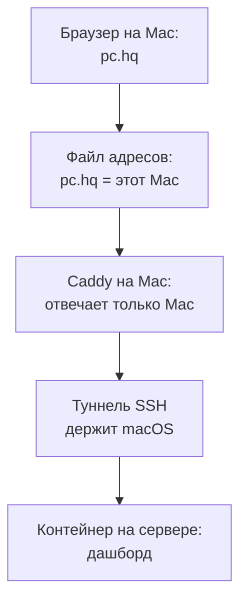

У меня на сервере живут страницы, которые нужны только мне. Самая свежая из них: дашборд учителя потока. Там видно, кто из студентов притих, какие встречи впереди, что бот отправит людям на неделе. Выставлять такое в интернет нельзя. Теперь я открываю его по адресу pc.hq, и снаружи его не видно совсем. Под капотом три детали: туннель с Mac на сервер, Caddy на Mac и одна строка в системном файле адресов. Работает это только с моего Mac. Следующий шаг понятен: Tailscale.

## Боль: страница, которую нельзя показывать

На дашборде имена студентов, их активность по неделям и очереди рассылок бота. Это рабочая кухня программы. Её место за закрытой дверью.

Первая мысль всегда одна: открыть порт и поставить пароль. Тогда вход пишешь сам и сам же его охраняешь. На странице с данными людей я так рисковать не хочу.

Вторая боль тише. Прошлый мой дашборд жил на адресе `localhost:3100`. Я про него забыл, и данные в нём замерли в августе. Номер порта никто не помнит, вкладка теряется. Нужен адрес, который набираешь не думая.

## Как устроено сейчас

Сервер у меня делится на контейнеры. Каждый сидит в частной сети, входа из интернета у них нет. Дашборд работает в одном из них и отдаёт страницу на внутреннем адресе.

Дорога от браузера до страницы такая:

1. Строка в системном файле адресов говорит Mac, что под именем pc.hq живёт он сам.
2. Caddy на Mac слушает обычный порт браузера. По имени pc.hq он передаёт запрос в туннель. Чужим запросам он отвечает отказом.
3. Туннель SSH держит сама macOS: поднимает при старте и перезапускает при обрыве.
4. На другом конце туннеля контейнер с дашбордом.

Ни одного открытого порта наружу. Своего входа с паролем тоже нет: дверью служит SSH-ключ, который и так лежит на Mac.

## Как это собирал агент

Дашборд агент уже выложил на сервер и поднял туннель. Страница открывалась по адресу с номером порта. Тогда я написал одну строку:


надо локально дать ему домен, например pc.hq


Агент пошёл смотреть, что у меня уже стоит. Оказалось, Caddy давно работает на Mac, а имя pc.hq в нём занято. Раньше оно вело на локальную версию другого моего сервиса. В сентябре тот переехал на сервер, и адрес с тех пор отвечал ошибкой.

Агент переключил pc.hq на туннель дашборда. В настройках Caddy он оставил заметку, что там было раньше, и закрыл адрес для всех, кроме самого Mac. Проверил: страница открывается, данные свежие.

## Что получилось и чего нет

Плюсы простые. Из интернета ничего не видно. Писать вход не нужно. Платить тоже не за что.

Минусов три:

- Работает только с этого Mac. С телефона дашборд не открыть.
- Каждый новый сервис требует свой туннель, строку в Caddy и строку в файле адресов.
- Зоны `.hq` в интернете нет, поэтому без строки в файле адресов имя не работает. Есть обходной путь: Chrome сам понимает любые имена на `.localhost`, например `pc.localhost`. Файл адресов тогда не нужен.

## Какие ещё есть варианты

| Вариант | Как работает | Когда подходит |
|---|---|---|
| Туннель SSH и локальное имя | Мой вариант: туннель с одного компьютера | Один человек, один компьютер |
| Tailscale | Частная сеть между твоими устройствами. Сервис получает адрес вида `имя.сеть.ts.net` с HTTPS, виден только внутри сети | Несколько устройств, нужен телефон |
| Свой WireGuard | То же самое, только ключи и настройку делаешь сам | Не хочется зависеть от чужого сервиса |
| Headscale | Свой сервер управления для приложений Tailscale | Удобство Tailscale без их облака |
| Cloudflare Tunnel и Access | Сервис получает адрес в интернете, а перед ним стоит вход через Cloudflare. Нужен свой домен в Cloudflare | Показать страницу коллеге без установки чего-либо |
| Открытый порт с паролем | Быстро, но вход и защиту делаешь сам | Для данных людей не советую |

Сервис в Tailscale открывает команда [serve](https://tailscale.com/kb/1312/serve): она отдаёт его только внутри твоей сети и сама получает сертификат для HTTPS.

Личный тариф у Tailscale бесплатный: до шести человек и сколько угодно устройств. Оговорка важная. По [условиям](https://tailscale.com/pricing) он только для некоммерческого использования. Дашборд программы для меня работа, значит честно смотреть рабочий тариф.

Если не хочется зависеть от их облака, есть [Headscale](https://github.com/juanfont/headscale). Это открытый сервер управления, который ставишь у себя, а приложения Tailscale подключаются к нему.

У Cloudflare вход ставится [перед сервисом](https://developers.cloudflare.com/cloudflare-one/applications/configure-apps/self-hosted-public-app/), и пускает он только тех, кого ты разрешил. Бесплатный тариф рассчитан на команды до 50 человек. Он хорош, когда страницу надо дать куратору, а ставить ему ничего нельзя.

## Почему следующий шаг Tailscale

Боль у меня одна: открыть дашборд с телефона перед уроком. Tailscale закрывает её целиком. Его ставят один раз на сервер, Mac и телефон. Дальше каждый новый сервис получает адрес внутри сети без отдельного туннеля и без строк в файлах.

Cloudflare понадобится, когда к дашборду придёт второй человек. Пока я смотрю на него один, частной сети хватает.

Про сам сервер я писал раньше: [OpenClaw на сервере за $6](/blog/openclaw-vps-6-dollars/) про то, как агент живёт там круглые сутки.

## Промпт, чтобы повторить


У меня на сервере есть сервис, который должен видеть только я. Открой его мне в браузере по короткому имени, например app.localhost. Наружу в интернет ничего не открывай и вход с паролем не пиши. Туннель пусть держит сама система и поднимает его после перезагрузки. Сначала проверь, что у меня уже стоит, и не сломай занятые имена.


Последняя фраза в промпте важная. У меня имя оказалось занято, и агент это заметил только потому, что сначала посмотрел.
