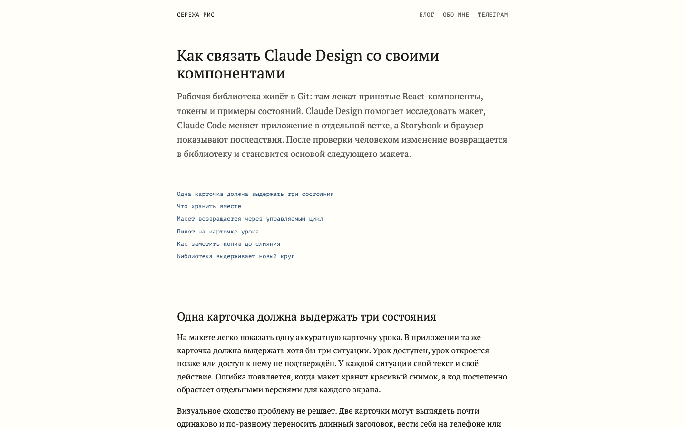
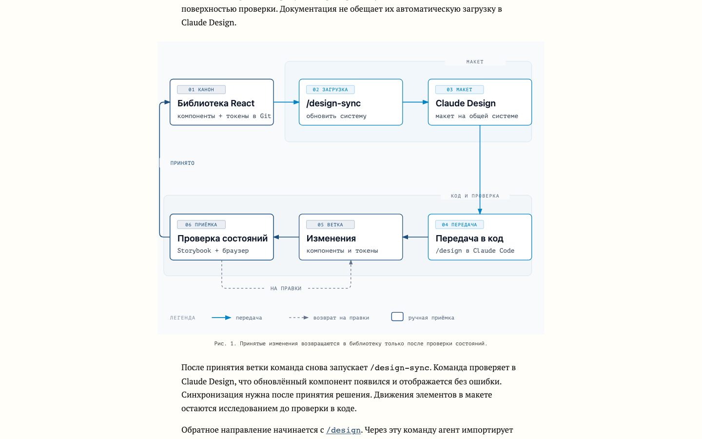
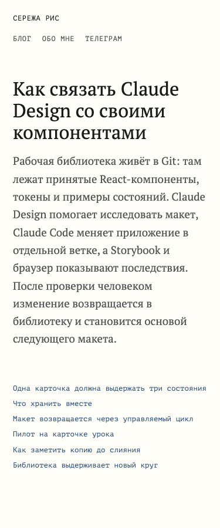
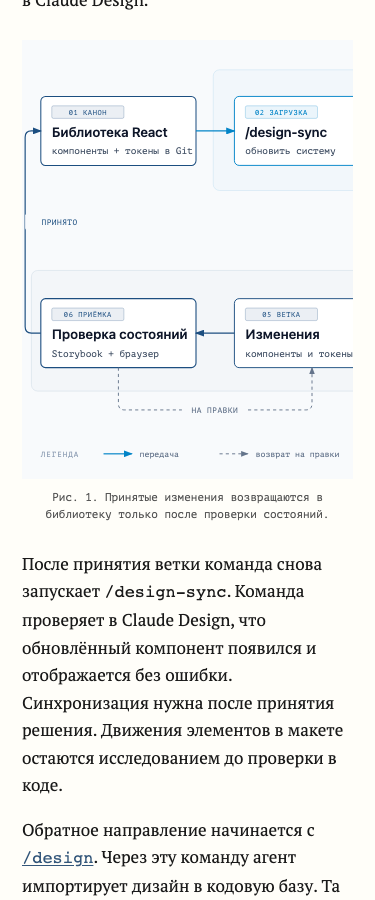

# Claude Design article verification

Article: [Как связать Claude Design со своими компонентами](../../../content/blog/claude-design-component-library.html)

Checked on 2026-09-24. This is a proposed workflow guide; the underlying Claude Design sync pilot has not been executed.

- Independent fact, specificity and editorial reviews: PASS.
- Style gate: PASS, 10/10 mechanically, 1241 prose words.
- Structural guide gate: PASS, six sections and seven contextual links.
- Hugo production build and frontmatter: PASS. The cover is intentionally omitted following owner feedback.
- SEO checks: canonical URLs, sitemap, ghost URL policy, target links and redirect sources passed. The article appears in the blog index and RSS with its canonical trailing-slash URL.
- Playwright: 1440×900 and 375×900; no document horizontal overflow or JavaScript errors. Both internal article links return 200, all six contents anchors resolve.
- One accessible inline SVG with title, description, numbered steps and automatic figure caption. At mobile width its scroll region is 331 px wide and contains a 580 px diagram.
- Public HTML source SHA-256: `a727acccb304cc73418f6136fa141ff141679c1fd06a03399373a090d8a56a4c`.

## Desktop

## Mobile

